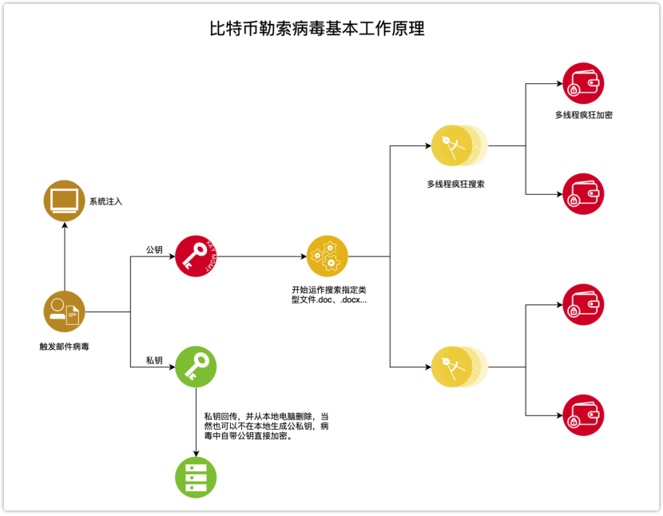
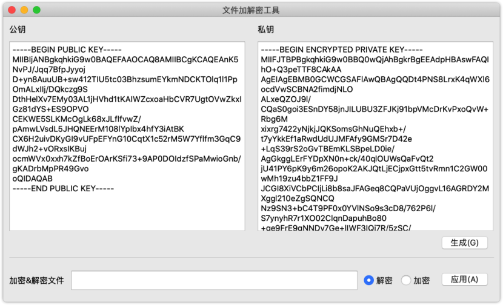
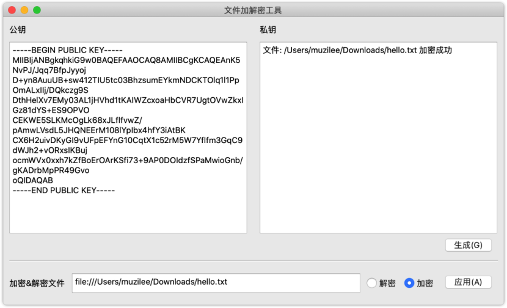
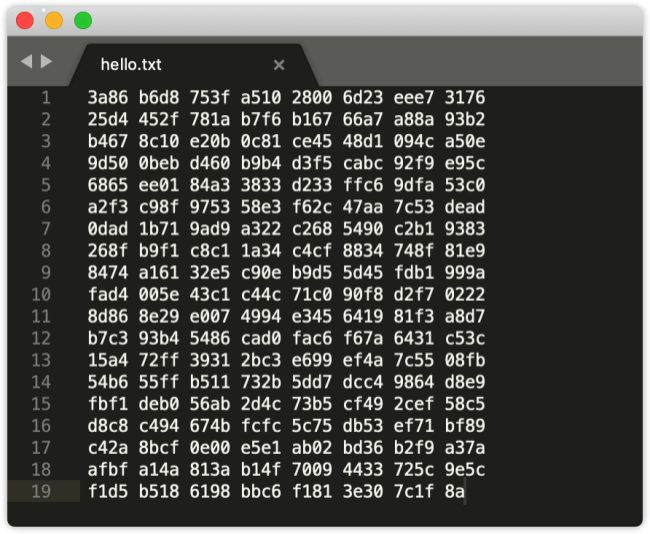
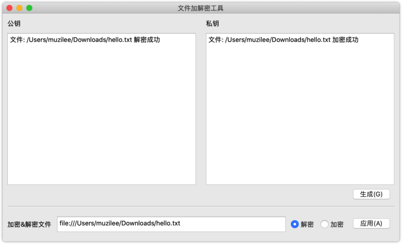
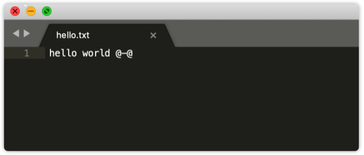
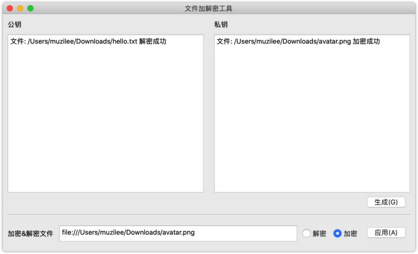
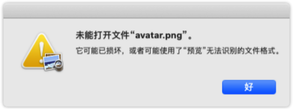

# 加解密工具简单原理说明
此加解密工具采用类比特币勒索病毒基础工作原理制作，采用RSA非对称加密算法，公钥加密，私钥解密。

# 功能说明
* 支持跨平台（MacOS、Windows、Deepin Linux v20）。
* 采用RSA非对称加密算法。
* 只能够对单个文件进行加密，暂不支持多文件批量加密。
* 支持加密各种类型的文件，包括（.doc,.docx,.txt,.png,.jpg ...）。

# 功能演示
这里采用MacOS客户端进行演示
### 生成公私密钥

### 加密hello.txt文件

### 解密hello.txt文件

### 加密图片文件
它不仅仅可以加密.txt文件，其它任何类型的文件都可以进行加密，下面我们加密一个图片文件。

